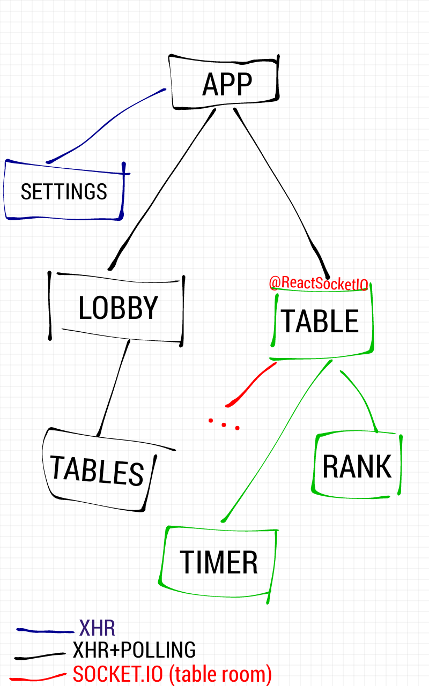
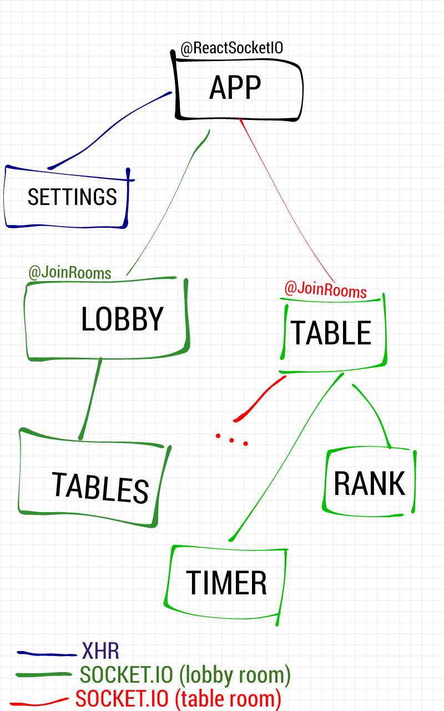

react-socket.io
===

**NOTE: Documentation WIP. NOT yet ready.**

*react-socket.io* library provides two HOCs to work with Socket.io,
ReactSocketIO and JoinRooms.

Usage
---

For the most simple use case just wrap the component you want to connect on
socket.io with:

```javascript
ReactSocketIO(
  'http://socket-io-url', // can be a function if you need params like auth: (props) => `http://socket-io-url?param=${props.param}`,
  (event, data, props) => console.log(`SocketIO event: ${event} with payload: ${data}`),
)(User)
```

Example - simple with 'redux'
---

The most simple example to use react-socket.io is to wrap a component with ReactSocketIO
and pass the endpoint and onMessage implementations to respond to received messages.

For example if we want to render the last registered user on system based on
socket.io 'lastRegistered' event. One approach could be:

```javascript
import ReactSocketIO from 'react-socket.io'
import { Component } from 'react'
import compose from 'redux'
import connect from 'react-redux'
import { updateLastUser } from './redux/lastUser/actions'

const User = (props) => (<div>{props.user.name} - {props.user.email}</div>)

const socketEndpoint = (props, context) => `http://socket-io.endpoi.nt/socket.io?token=${props.token}`
const onMessage = (event, payload, props) => {
  switch (event) {
    case 'userRegistered':
      props.onUpdate(payload)
      break
  }
}

const mapStateToProps = (state) => ({
  authToken: state.authToken,
  lastUser: state.lastUser,
})

const mapActionsToProps = { updateLastUser }

export default compose(
  connect(mapStateToProps, mapActionsToProps),
  ReactSocketIO(socketEndpoint, onMessage),
)(User)
```

Example - simple without 'redux'
---

There is no coupling between *react-socket.io* and redux. It helps using
a state container but you can implement the above as:

```javascript
import ReactSocketIO from 'react-socket.io'
import { Component } from 'react'

const User = (props) => (<div>{props.user.name} - {props.user.email}</div>)

const socketEndpoint = (props, context) => `http://socket-io.endpoi.nt/socket.io?token=${props.token}`
const onMessage = (event, payload, props) => {
  switch (event) {
    case 'userRegistered':
      props.onUpdate(payload)
      break
  }
}

const LastRegisteredUser = ReactSocketIO(endpoint, onMessage)(User)

class StateContainer {
  state: {
    authToken: 'deadbeef',
    lastUser: {},
  }

  updateLastUser: (lastUser) => this.setState({ lastUser })

  render() {
    return (<LastRegisteredUser
      token={this.state.authToken}
      user={this.state.lastUser}
      onUpdate={this.updateLastUser} />)
  }
}

export default StateContainer
```

Supported Workflows
---

Here we're going to describe the two possible workflows that
*react-socket.io* can support using a game as an example.
**WIP ...**

**Classic:**



**Navigation:**



API
---

ReactSocketIO(socketEndpoint, onMessage, options)
- socketEndpoint (string|function)
- onMessage (function)
- options (object)

JoinRooms(rooms, onMessage, options)
- rooms (array)
- onMessage (function)
- options (object)
